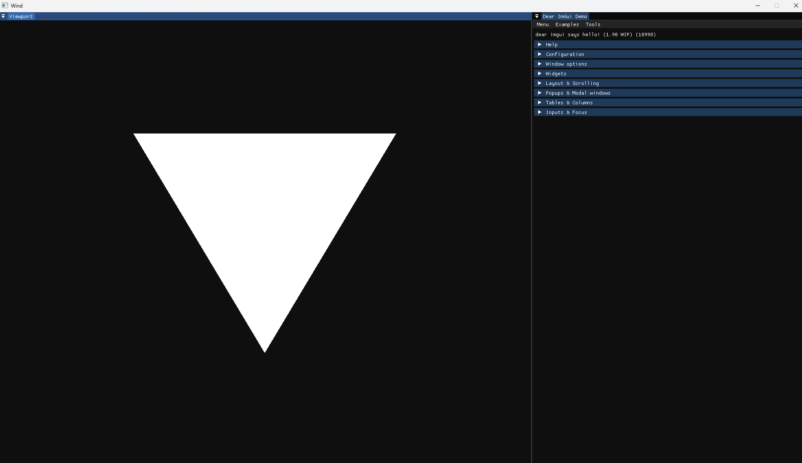

# WindVK 
Experiment graphics engine which mainly learned from unreal. 

## Build
Using command below to generate project file
```cmd
xmake project -k vsxmake -m "debug,release" 
```

## Current Status
Current just a simple triangle with imgui viewport.


## Reference
* [WebGPU](https://developer.mozilla.org/en-US/docs/Web/API/WebGPU_API)
* [LuisaCompute](https://github.com/WeebOwO/LuisaCompute/tree/next/src/backends/vk)
* [filament](https://github.com/google/filament)
* [Hazel](https://github.com/TheCherno/Hazel)